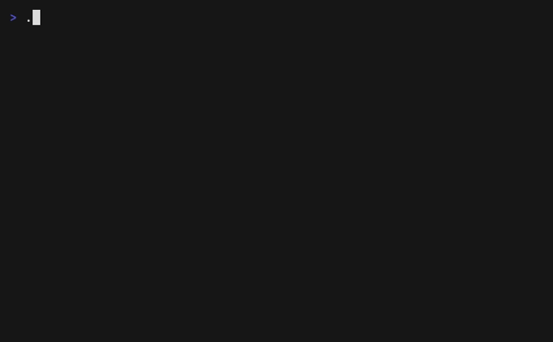
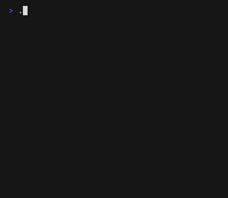
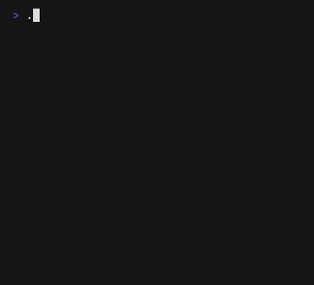

# 천지불인(天地不仁): 생명 게임

콘웨이(John Conway)의 생명 게임을 터미널에서 돌린다. 그래픽 라이브러리는
하나도 쓰지 않는다 — 콘웨이에게 바둑판이 족했다면 우리에게는 ANSI 이스케이프
코드가 족하다.



## 실행

```sh
make run                           # 40×22 격자, 밀도 0.25, 초당 10세대
./life -w 60 -h 30 -p 0.3 -fps 15  # 취향껏
./life -pattern gun                # 고스퍼의 글라이더 총
```

시작 배치는 밀도 `-p`의 확률로 무작위로 뿌려지므로 실행할 때마다 다른 우주가
열린다. `-pattern`으로 도감의 명작 다섯 점 — `glider`, `lwss`(경량 우주선),
`rpentomino`, `pulsar`, `gun`(고스퍼의 글라이더 총) — 을 골라 걸 수도 있다.
다만 이 우주는 원환면이라, 총이 쏘아 보낸 글라이더는 우주를 한 바퀴 돌아 제
몸에 와서 박힌다. 총도 인과응보는 피하지 못한다.

 

글라이더는 네 세대마다 대각선으로 한 칸 걷는다. 가장자리가 없는 우주라 화면
밖으로 떨어지는 대신 반대편에서 돌아온다 — 잘 보면 모서리를 감아 도는 순간
몸이 잠시 두 쪽으로 나뉜다. 펄사는 주기 3으로 명멸하는 등대다. 격자는 가장자리를 마주 이어 붙인 원환면이라 글라이더가 화면 밖으로
떨어지는 대신 반대편에서 돌아온다. `Ctrl-C`로 끝낸다 — 이 우주에 바깥에서
들어오는 유일한 사건이다.

## 문학적 프로그래밍

이 저장소의 원본은 [life.w](life.w) 하나다. 프로그램이자 수필인 GWEB 문서로,
노자의 천지불인에서 출발해 콘웨이가 찻상에서 바둑돌로 규칙을 조율한 이야기,
고스퍼의 글라이더 총과 50달러 내기, 그리고 만년의 "나는 생명 게임이 싫다"까지
— 코드 곁에 어울리는 일화를 심어 두었다. 나머지는 전부 `make`가 재생성한다:

```sh
make            # tangle + 실행 파일 + 문서 조판
make doc        # life.pdf — 조판된 수필
make demo       # demo.gif — vhs로 찍는 데모 (https://github.com/charmbracelet/vhs)
```

빌드에는 [Go](https://go.dev)와 GWEB 도구(`gtangle`/`gweave`)가, 문서 조판에는
luatex와 kotexgweb 매크로가, 데모 녹화에는 vhs가 필요하다.

## 규칙

세포의 운명은 여덟 이웃 가운데 살아 있는 수 $n$ 하나로 정해진다: 죽은 칸은
$n=3$이면 태어나고, 산 세포는 $n=2,3$이면 살아남으며, 그 밖에는 모두 죽는다.
자비도 예외도 없다. 그런데 이 세 줄에서 기는 것, 나는 것, 제 몸을 베껴 낳는
것들이 나온다 — 자세한 이야기는 `make doc`으로 뽑은 [life.pdf](life.pdf)에 있다.
